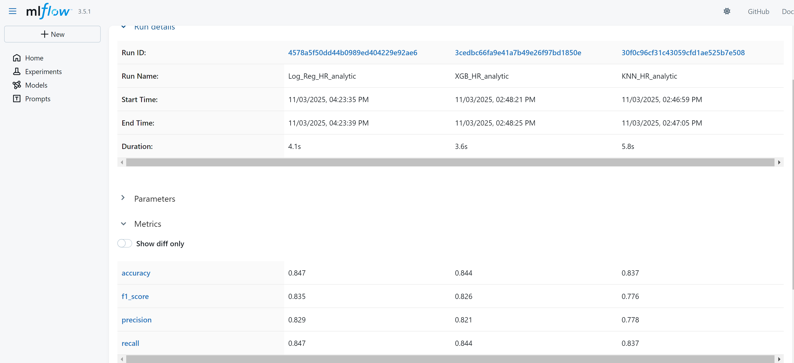
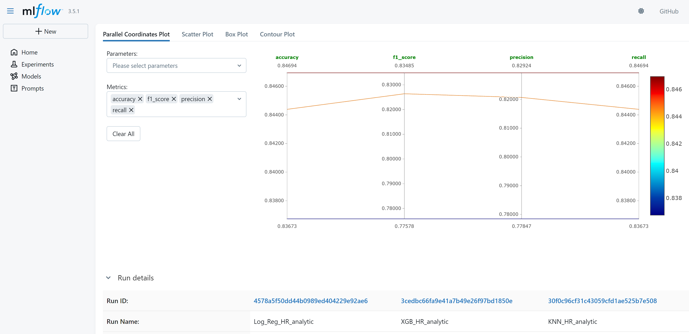
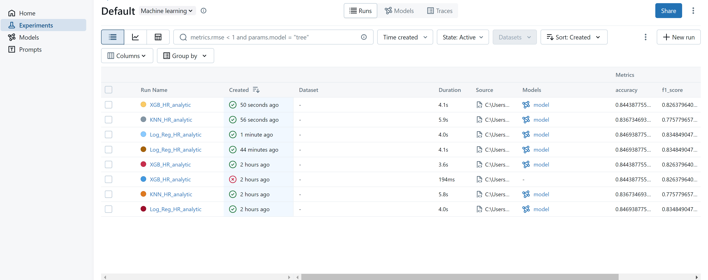

# MLOPS Lab 4  
## ML-Flow lab  
  
  
  
### Changes/Unique Modifications:  
A new dataset was used: "HR Analytics: Predicting Employee Attrition"  
Link: https://www.kaggle.com/datasets/rishikeshkonapure/hr-analytics-prediction?resource=download  
Data exploration and preprocessing was conducted. This resulted in:  
- 7 features (columns) being dropped.
- Categorical features one-hot encoded.
- Numerical features Standard Scaled.  

Afterwards, 3 different model types were evaluated: Logistic regression, KNN, and XGBoost.  
The performance was able to be evaluated easily with the ML-Flow UI.

### Instructions to Run:  
1. Clone the repo
2. Create a virtual environment
3. Install dependencies with requirments.txt
4. Run all cells
5. Navigate to last cell and click on link to 'local host'

### Challenges encountered:
1. Understanding the workflow and what data is needed for UI
2. How UI connects wuth local code.
3. Updating stale link to UI (I could not view new experiments)

### Pictures of ML-Flow UI:
1. Comparing raw metrics in table format:

2. Comparing metrics with graphic:

3. Multiple Experiments ran:

